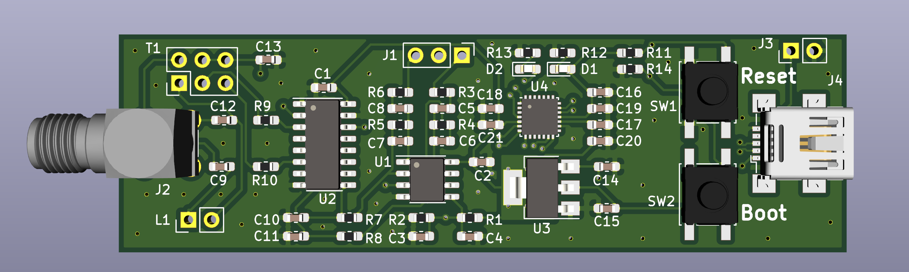

# simple-sdr PCB
Simple Software Defined Radio based on [Softrock Lite II](http://wb5rvz.org/softrock_lite_ii/index/projectId=8). The IF generation and sampling is handled by an STM32F042. This design is intended to build a low cost [NAVTEX](https://en.wikipedia.org/wiki/NAVTEX) receiver, but can be used for all kinds of purposes. The current design has an input bandpass filter ranging from 400 - 1600 KHz.

